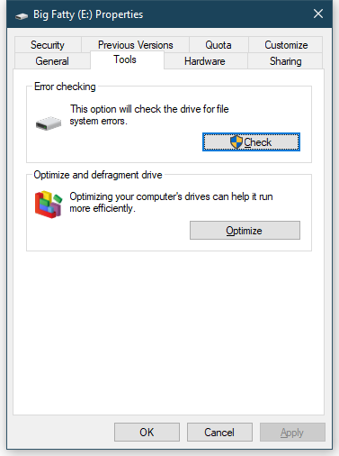

# Windows Hard Drive Failure

## Background
* The customer dropped the computer. 
* Hardware not functioning. 
* Getting a blue screen and hardware errors.
* HP ProBook 440G2

## Symptoms
*These are some of the common symptoms each scenario may be different*

* Receiving blue screen of death errors
* Startup slow
* Frequent and irregular crashes especially while booting up windows
* Disappearing files or foldersReally long wait times to access files and folders
* The hard disk may make a lot of loud noises when it previously didn't

## Diagnosis
1. Pull up File Explorer, right-click on a drive, and click on Properties. Click on the Tools tab, and click on “Check” under the “Error checking” section.

    
    
    Even though Windows probably hasn’t found any errors with your drive’s file system in its regular scanning, you can run your own manual scan to be sure. This shouldn’t take very long, but I wouldn’t trust the progress bar—mine sat on “20 seconds remaining” for longer than that, but didn’t take more than a minute or so to complete.    
    
2. Systems nowadays have a hard drive test built into the bios, in this scenario HP has one. 

    * To access, reboot and press F2 repeatedly you can access it. (depending on the system you have to look up how to access it)

3. All these steps may pass with no issues on the drive but another step that can be done is to look at the system event logs.  Go to the start menu and search for event viewer
    * Click Start, point to Programs, point to Administrative Tools, and then click Event Viewer.
    * In the top of the console tree, right-click Event Viewer (local), and then click Connect to another computer.
    * Either browse to the computer name or type the computer name in the dialog box to view the Event log on that computer.
    * Click OK.
    * Under windows, logs-> system look for errors relating to hard drive problem such as bad blocks 

4. Here are some more diagnostic steps that can be taken: [https://lifehacker.com/how-to-check-if-your-hard-drive-is-failing-1835065626](https://lifehacker.com/how-to-check-if-your-hard-drive-is-failing-1835065626)

## Solution
1. Always tell the customer what the issue is and recovery of data is NOT guaranteed
2. Try to move all the necessary data somewhere else as quickly as possible because drive could fail at any time 
3. Get Windows license key
    * Get it from the customers Microsoft account: [https://account.microsoft.com/billing/orders](https://account.microsoft.com/billing/orders)  (if having trouble here is more details: [https://support.microsoft.com/en-us/help/4000641/microsoft-store-find-your-downloads-and-product-keys](https://support.microsoft.com/en-us/help/4000641/microsoft-store-find-your-downloads-and-product-keys)
    * If the customer does not know or have microsoft account (and your tried step 1 already) here are a few more ways to get it: [https://www.howtogeek.com/206329/how-to-find-your-lost-windows-or-office-product-keys/](https://www.howtogeek.com/206329/how-to-find-your-lost-windows-or-office-product-keys/)
    * If none of these steps are successful call Microsoft support: [https://support.microsoft.com/en-us/contactus/](https://support.microsoft.com/en-us/contactus/)
4. Make sure all data is backed up
5. Make sure you have the correct Windows operating system image: [https://www.microsoft.com/en-us/software-download](https://www.microsoft.com/en-us/software-download)
6. Install the operating system to the new hard drive from the newly downloaded image
7. Install the new hard drive into the computer 
8. Setup new operating system and make sure all customers settings and concerns are addressed

